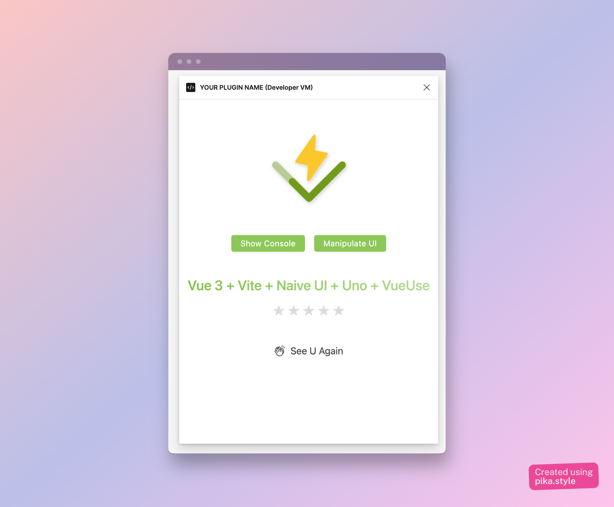

# masterGo Plugin Starter Power By Vue

A starter template using vue3 and vite for developing masterGo plugins





## Choose Love UI Librairy By Branch

- [Naive Ui](https://github.com/Leizhenpeng/starter-mastergo-vue/tree/naive-ui)
- [Acro Design](https://github.com/Leizhenpeng/starter-mastergo-vue/tree/arcro-ui)
- [Tewak Pane](https://github.com/Leizhenpeng/starter-mastergo-vue/tree/tweakpane)

## Get started 

```
pnpm i
```
## dev

Start a server with the following command to help you style
the plugin UI, thanks to hotreload

```bash
pnpm run dev:ui //dev ui
pnpm run dev:hook // dev masterGo code
```

## change manifest.json
get your own plugin Id, change it in manifest.json

## build

Run the following command to compile your plugin to show in masterGo
```bash
pnpm run build
```


## masterGo Developer
"Our developer platform puts the power in your hands to create the tools teams need to improve efficiency, expand functionality, and bring ideas to life. Take a look at our APIs, documentation, guides, and references to get started."

### Documentation

More about masterGo plugins: [here](https://developers.mastergo.com/guide/setup.html)


## Librairy

- [Naive UI](https://www.naiveui.com)

- [Arco Design](https://arco.design/vue/docs/start)

- [TweakPane](https://cocopon.github.io/tweakpane/)
  
- [VueUse](https://vueuse.org/)